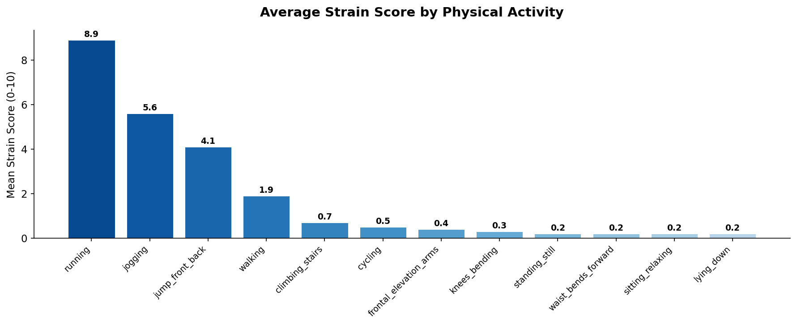
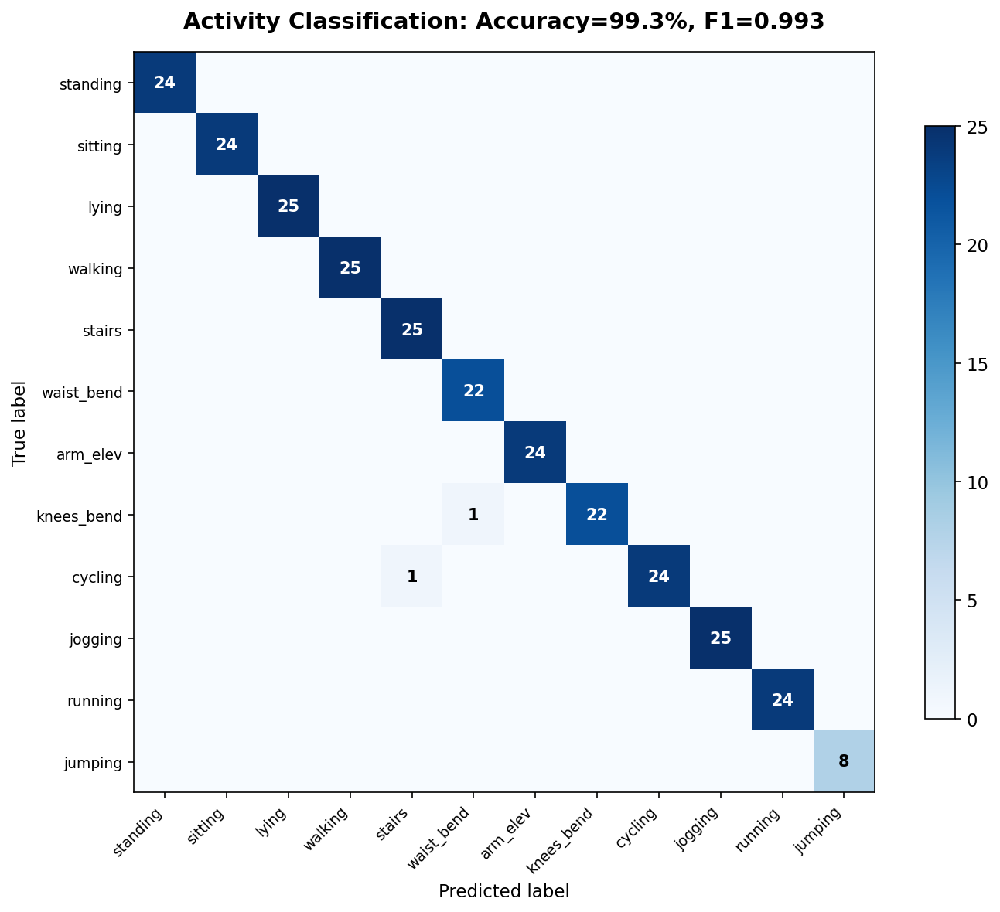
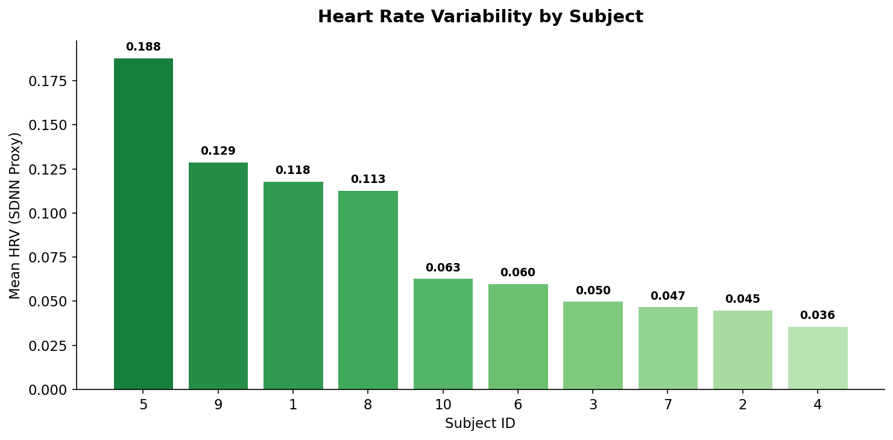
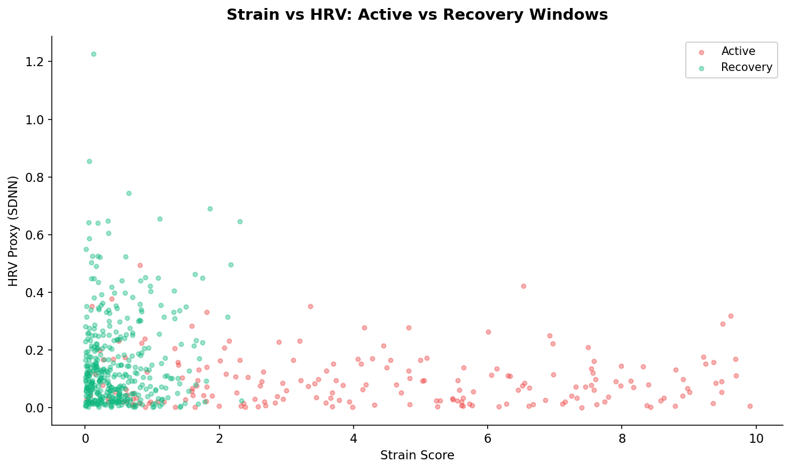
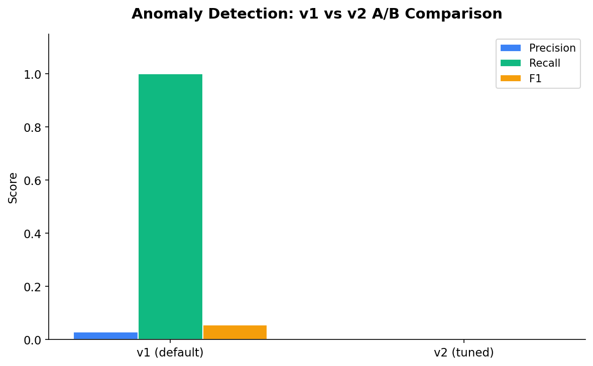

<p align="center">
  <picture>
    <source media="(prefers-color-scheme: dark)" srcset="assets/nh-logo-dark.svg" width="80">
    <source media="(prefers-color-scheme: light)" srcset="assets/nh-logo-light.svg" width="80">
    
  </picture>
</p>

<h1 align="center">Wearable Health Anomaly Detection Pipeline</h1>
<p align="center"><b>Sensor data pipeline with activity classification, anomaly detection, and A/B experiment evaluation</b></p>

<p align="center">
  <a href="https://github.com/nicholasjh-work/wearable-health-anomaly-detection"></a>
  <a href="https://github.com/nicholasjh-work/wearable-health-anomaly-detection/blob/main/LICENSE"></a>
  <a href="https://github.com/nicholasjh-work/wearable-health-anomaly-detection"></a>
  <a href="https://github.com/nicholasjh-work/wearable-health-anomaly-detection"></a>
</p>

<p align="center">
  
  
  
  
  
  
</p>

---

### What This Does

<table>
<tr>
<td>

**1.2M sensor readings** from **10 subjects** performing **12 physical activities** flow through a medallion architecture (Bronze/Silver/Gold) on Databricks.

The pipeline engineers health-relevant features from raw accelerometer, gyroscope, and ECG signals: **HRV proxy** (SDNN from inter-peak intervals), **strain scoring** (0-10 composite), and **recovery window detection**. A Random Forest classifier achieves **99.3% accuracy** (F1 0.993) across all 12 activities. Isolation Forest anomaly detection runs through an **A/B evaluation framework** with paired t-test, Cohen's d, and Ship/Iterate/Kill decision logic.

**Real sensor data. Real statistical evaluation. No toy datasets.**

</td>
</tr>
</table>

---

### Key Results

| Metric | Value |
|:-------|:------|
|  | **99.3% accuracy, F1 0.993** across 12 activities |
|  | Running 8.9, jogging 5.6, walking 1.9, sedentary <1.0 |
|  | 5x variation across subjects (0.036 to 0.188 SDNN) |
|  | Isolation Forest v1 vs v2 with A/B evaluation |
|  | 1.2M rows, 23 sensor columns, 50Hz sampling rate |

---

### Results











---

### Architecture

```
UCI MHEALTH (10 subjects, 23 sensors, 50Hz, 1.2M rows)
        │
        ▼
┌──────────────┐    ┌──────────────┐    ┌──────────────┐
│    Bronze    │ →  │    Silver    │ →  │     Gold     │
│   Raw Data   │    │  Engineered  │    │  Aggregated  │
│  1.2M rows   │    │   Features   │    │   Metrics    │
└──────────────┘    └──────────────┘    └──────────────┘
                          │
                 ┌────────┴────────┐
                 │   ML Pipeline   │
                 │  RandomForest   │
                 │  IsolationForest│
                 │  A/B Evaluation │
                 └─────────────────┘
                          │
                          ▼
                 ┌─────────────────┐
                 │ Results Dashboard│
                 │   (matplotlib)   │
                 └─────────────────┘
```

---

### Notebooks

| # | Notebook | Purpose |
|:--|:---------|:--------|
| 01 | [](01_ingest_and_features.py) | Download MHEALTH, build bronze + silver with rolling features |
| 02 | [](02_activity_classification.py) | Random Forest classifier (19 vs 10 features) |
| 03 | [](03_anomaly_detection.py) | Isolation Forest v1 vs v2 comparison |
| 04 | [](04_ab_experiment_eval.py) | Paired t-test, Cohen's d, Ship/Iterate/Kill decision |
| 05 | [](05_gold_layer_export.py) | Aggregate to gold tables, export CSVs |
| viz | [](viz_p1_results_dashboard.py) | Strain, HRV, confusion matrix, A/B comparison charts |

---

### Feature Engineering

| Feature | Method | Output |
|:--------|:-------|:-------|
|  | 5-second windows over accel, gyro, ECG | Mean, std, max, range per sensor per window |
|  | SDNN from ECG inter-peak intervals | Continuous HRV estimate per window |
|  | Weighted composite (60% accel + 40% gyro) | 0-10 scale normalized to population range |
|  | Activity labels 0-3 flagged as rest | Binary recovery flag + recovery quality proxy |

---

### A/B Experiment Framework

> Anomaly detection models evaluated using statistical significance testing, not just accuracy metrics.

| Component | Description |
|:----------|:------------|
|  | Isolation Forest, contamination=0.05, n_estimators=200 |
|  | Isolation Forest, adaptive contamination, n_estimators=300 |
|  | Paired t-test, Cohen's d effect size |
|  | Ship / Iterate / Kill framework based on lift + significance |

---

### Tech Stack

| Component | Technology |
|:----------|:-----------|
|  | Databricks Community Edition (Serverless) |
|  | scikit-learn (RandomForest, IsolationForest) |
|  | SciPy (paired t-test, Cohen's d) |
|  | pandas, NumPy |
|  | matplotlib |
|  | Python 3.11 |

---

### Dataset

[UCI MHEALTH](https://archive.ics.uci.edu/dataset/319/mhealth+dataset) — 10 subjects, 23 sensor columns, 12 activity labels, 50Hz sampling. CC BY 4.0 license.

---

<p align="center">
  <a href="https://linkedin.com/in/nicholashidalgo"></a>&nbsp;
  <a href="https://nicholashidalgo.com"></a>&nbsp;
  <a href="mailto:analytics@nicholashidalgo.com"></a>
</p>
